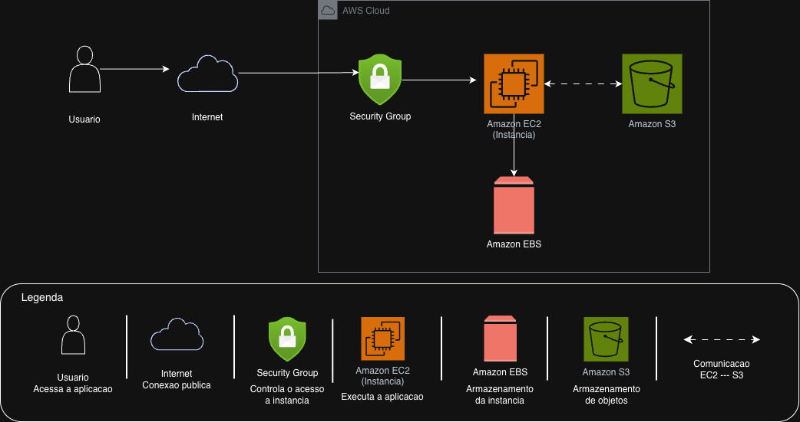

# Desafio AWS EC2 - DIO

## Arquitetura da Solução

## Descrição

Este projeto foi desenvolvido como parte do desafio da DIO com o objetivo de consolidar os conhecimentos sobre o Amazon EC2 e serviços relacionados da AWS.

## Serviços Utilizados

### Amazon EC2

Serviço de computação em nuvem responsável pela execução da aplicação.

### Amazon EBS

Serviço de armazenamento em bloco utilizado pela instância EC2 para armazenar sistema operacional, aplicações e dados.

### Amazon S3

Serviço de armazenamento de objetos utilizado para armazenar arquivos, imagens, documentos e backups.

### Security Group

Firewall virtual responsável por controlar o tráfego de entrada e saída da instância EC2.

## Fluxo da Arquitetura

1. O usuário acessa a aplicação.
2. A conexão passa pelo Security Group.
3. A instância EC2 processa as requisições.
4. O EBS fornece armazenamento para a instância.
5. O S3 armazena arquivos e backups.

## Aprendizados

Durante este laboratório foi possível compreender:

* Criação e gerenciamento de instâncias EC2;
* Utilização de volumes EBS;
* Armazenamento de arquivos no Amazon S3;
* Configuração de Security Groups;
* Organização de arquiteturas na AWS.

## Autora

Jéssica Trindade Nascimento de Brito

